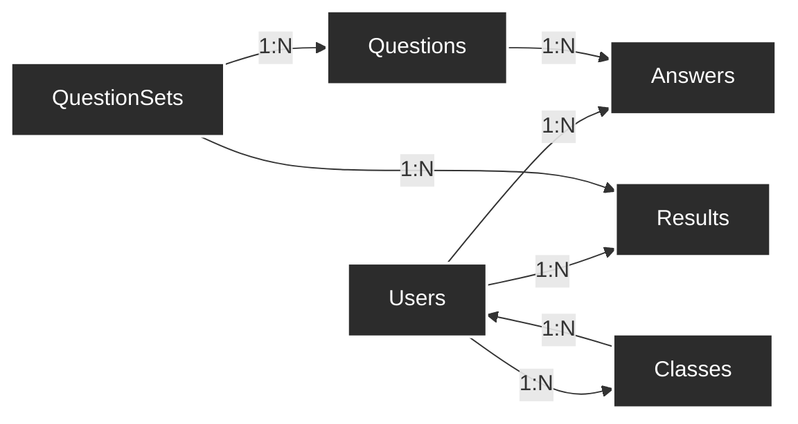
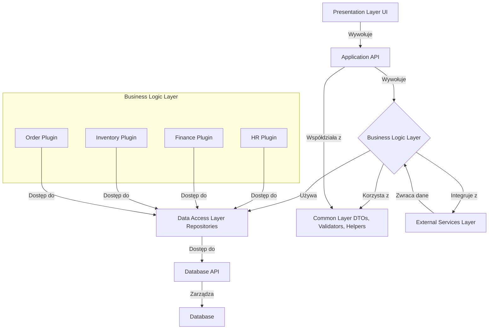

# Cyfron

```mermaid
graph LR
    A[Users] -->|1:N| B[Answers]
    A[Users] -->|1:N| D[Results]
    A[Users] -->|1:N| F[Classes]
    C[QuestionSets] -->|1:N| D[Results]
    C[QuestionSets] -->|1:N| E[Questions]
    E[Questions] -->|1:N| B[Answers]
    F[Classes] -->|1:N| A[Users]

    classDef table fill:#2C2C2C,stroke:#FFFFFF,stroke-width:2px,color:#FFFFFF;
    class A,B,C,D,E,F table;
```

```mermaid
graph TD
    A[Presentation Layer UI] -->|Wywołuje| API[Application API]
    
    subgraph Business Logic Layer
        B1[HR Plugin] 
        B2[Finance Plugin]
        B3[Inventory Plugin]
        B4[Order Plugin]
    end
    
    API -->|Wywołuje| B{Business Logic Layer}
    
    B -->|Używa| C[Data Access Layer Repositories]
    C -->|Dostęp do| DB[Database API]
    DB -->|Zarządza| D[Database]
    B -->|Korzysta z| E[Common Layer DTOs, Validators, Helpers]
    API -->|Współdziała z| E
    B -->|Integruje z| F[External Services Layer]
    F -->|Zwraca dane| B

    %% Połączenia między modułami a warstwą logiki biznesowej
    B1 -->|Dostęp do| C
    B2 -->|Dostęp do| C
    B3 -->|Dostęp do| C
    B4 -->|Dostęp do| C
```